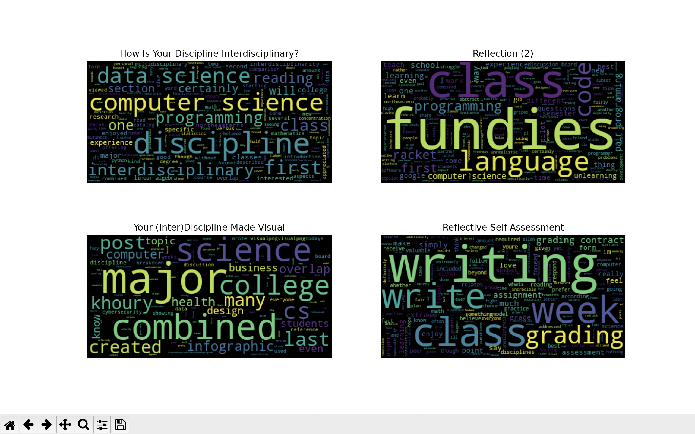

## ENGW 3315: Interdisciplinary Advanced Writing in the Disciplines
---
### Final Portfolio
This project is the culmination of a semester's worth of work in Advanced Writing. Consisting of 4 pieces of writing alongside short intros for context, this portfolio along with a final reflection is meant to be a showcase of my writing.

#### **Week 4: February 10** 
> [How Is Your Discipline Interdisciplinary?](how-is-your-discipline-interdisciplinary.md)

#### **Week 5: February 19**
> [Reflection (2)](reflection2.md)

#### **Week 6: February 24**
> [Your (Inter)Discipline Made Visual](your-discipline-made-visual.md)

#### **Week 8: March 10**
> [Reflective Self-Assessment](reflective-self-assessment.md)

#### **Extra Visual: Word Clouds**
In brainstorming ideas for this portfolio, I thought word clouds would be a super cool way to visualize my work. One of my homeworks for my data science class this semester was textual analysis of six poems read at presidential inuagurations. For the assignment, one task involved making word clouds. I feel like a lot of my writing for this class revolved around two main subjects: computer science and reflection. I thought this visualization would help provide insight into whether or not this was really the case.
> 