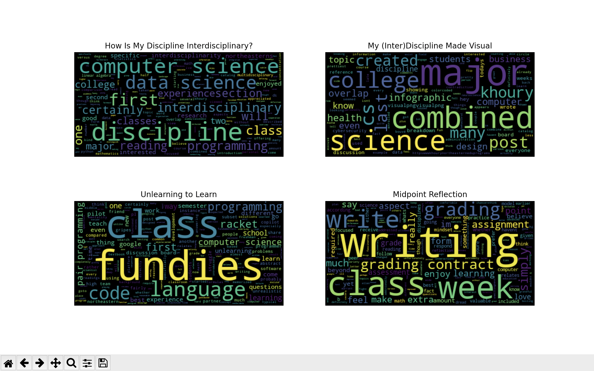

# README: An Interdisciplinary Exploration Through Writing
### Shawn Robin
### ENGW 3315: Interdisciplinary Advanced Writing in the Disciplines
---
## Prologue
This project is the culmination of a semester's worth of work in Advanced Writing. Consisting of 4 pieces of writing alongside short intros for context, this portfolio along with a final reflection is meant to be a showcase of my writing. In brainstorming ideas for this portfolio, I thought word clouds would be a super cool way to visualize my work. One of my homeworks for a data science class this semester was textual analysis of six poems read at presidential inuagurations. For the assignment, one task involved making word clouds. I feel like a lot of my writing for this class revolved around two main subjects: computer science and reflection. I thought this visualization would help provide insight into whether or not this was really the case. As such, I've included the visualization as a preview into some of the themes you can expect while reading. Enjoy!

> [Source Code](word_cloud_generator.py)

## Artifact 1
*Week 4: February 10*
> [How Is My Discipline Interdisciplinary?](how-is-your-discipline-interdisciplinary.md)

## Artifact 2
*Week 6: February 24*
> [My (Inter)Discipline Made Visual](your-discipline-made-visual.md)

## Artifact 3
*Week 5: February 19*
> [Unlearning to Learn](reflection2.md)

## Artifact 4
*Week 8: March 10*
> [Midpoint Reflection](reflective-self-assessment.md)

## Final Reflection
