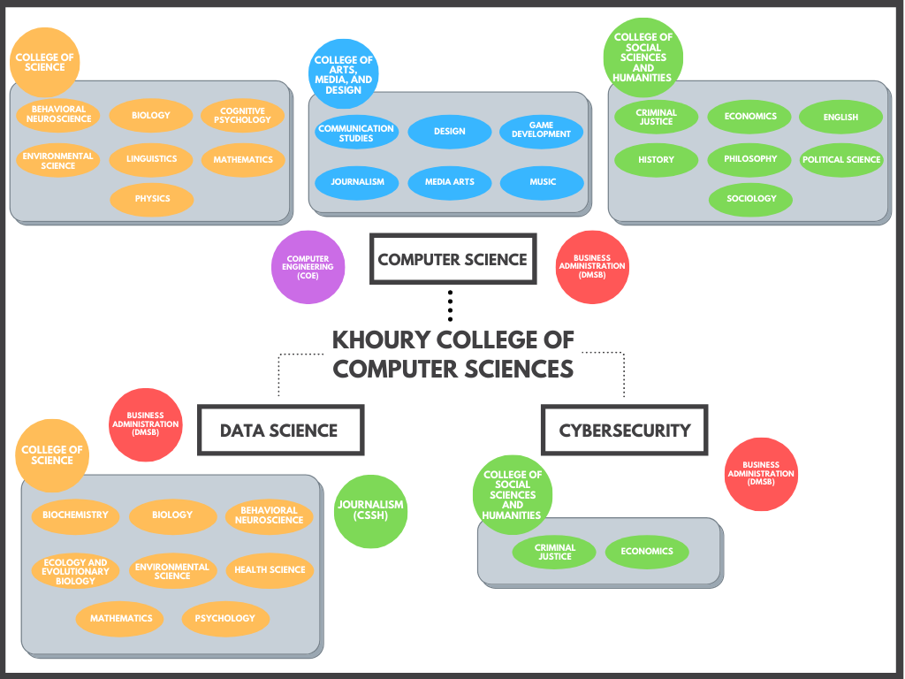

***
Hey everyone, 

In last week's discussion board post, I wrote about Khoury College's many combined majors. As such, for today's post, I have created an infographic showing just how many there are (35!). The breakdown is 3 combined Cybersecurity majors, 10 combined Data Science majors, and 22 combined Computer Science majors. As a reference, I used https://www.khoury.northeastern.edu/programs/. As such, there seemed to be no overlap with the Bouvé College of Health Sciences, but there is some contradiction with the the course catalog. For example, Health Sciences appears under the College of Science. The infographic isn't the prettiest, and looking back at it I should have had every combined major be a circle color-coded to its college but it's already pretty late, and I have the excuse of not being a design major. 

None the less, this was fun to make and I got to learn a couple things, like the fact that you can combine Business Administration with any of the 3 Khoury majors. I would definitely be interested in more information about this topic, such as students enrolled in each combined major. Personally, I feel like I know a lot of CS + Design and CS + Business students. On the flip side though, I actually know the person who created the CS + Behavioral Neuroscience major just last fall! While I am not even a combined major, it is so great knowing that an overlap seems to exist with just about any other field or discipline one can think of. Plus, that's not even counting the various disciplines just housed within computer science. If you haven't been able to tell by now, I'm quite passionate about my major, and I would love to engage with any of you about the topic in the comments below!

Best,  
Shawn
